# INFERNO
## General
INFERNO is a simple tool that aims to generate time series interferograms from Sentinel-1 synthetic aperture radar (SAR) images.

Inferno will run a chain of processes :

1. Search and download Sentinel-1 products from PEPS or SCIHUB plateforms, considering a given region of interest (ROI) and a specific time interval
2. Propose interferometric couples according to the available Sentinel-1 products, and related scenarios (see [Scenario Choices](#scenario-choices) section)
3. Compute interferograms and several quality indicators, depending on the chosen options selected by the user (see [Interferogram](#interferogram) section)


## Docker
See [Docker](docker)

## Install
### Dependencies

#### **DiapOTB** 
INFERNO depends on [DiapOTB](https://gitlab.orfeo-toolbox.org/remote_modules/diapotb) and especialy on its [python API](https://gitlab.orfeo-toolbox.org/remote_modules/diapotb#python).
Please refer to its documentation to install it.

#### **DEM**
INFERNO calculations depend on DEM (Digital Elevation Model) of the Region of Interest. The current DEM to be used is the 30-Meter SRTM. It can be downlaoded easily for the area of interest at  https://dwtkns.com/srtm30m/ (A NASA Earthdata login is required to download the files). 

#### **SNAPHU**  
INFERNO's unwrapping phase step relies on [SNAPHU](https://web.stanford.edu/group/radar/softwareandlinks/sw/snaphu/). To compile SNAPHU in ```snaphu-v2.0.5/bin``` folder, the following command line must be executed from INFERNO folder.

```bash 
# move to snaphu-v2.0.5 directory
cd snaphu-v2.0.5
# create bin directory (snaphu-v2.0.5/bin )
mkdir bin 
# move to src directory 
cd src
# compile SNAPHU in snaphu-v2.0.5/bin
make
```

### Install INFERNO
To install and use INFERNO, ```DIAPOTB_INSTALL_DIRNAME``` and ```SNAPHU_INSTALL_DIRNAME```, environment variables must be set with the paths to the installation folders of DiapOTB and SNAPHU respectively:

```bash
export DIAPOTB_INSTALL_DIRNAME=<Path to DiapOTB installation folder>
export SNAPHU_INSTALL_DIRNAME=<Path to SNAPHU installation folder>
```

Then use the following command:
```bash
pip install .
```

## Start
To start INFERNO, run "`inferno`" in the terminal.
To begin press "start".   
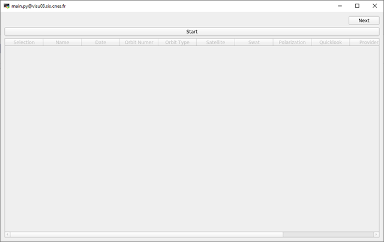

### Parameters
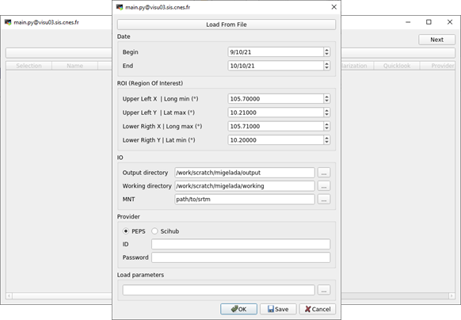  

First, we define some useful parameters to retrieve the SAR images and for the rest of the process:
- the time interval
- the ROI which is given in geographic coordinate system, in degree (°)
- an output directory: this folder will contain all the output files of INFERNO
- a working directory: this folder will contain some intermediate data
- a DEM (Digital elevation model): Path to Digital Elevation Model of the ROI
- a provider: we can chose between  [PEPS](https://peps.cnes.fr/rocket/) or [SCIHUB](https://scihub.copernicus.eu/), and we must provide authentication information (id and password)  

Press "Ok" button to launch the research and to list all available products, according to the time interval and ROI.

These parameters can also be loaded from a configuration file. Similarly, they can be saved into a file using "save" button. 

### Retrieve Sentinel-1 Products
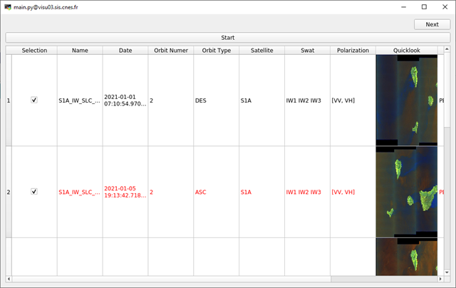   
Lists all available products according to time interval and ROI. Each row defines a Sentinel-1 product and the columns define some information about the product (Name, Date of capture, Orbit number, Orbit type, Satellite, Polarization).  
The lines displayed in red correspond to products that are not available on disk (the products are on magnetic tape. It will take some time before download starts).

At this step, we select the products that will be use by INFERNO to generate processing scenarios (see [Scenario Choices](#scenario-choices))  
By default, all products are selected.


### Scenario Choices
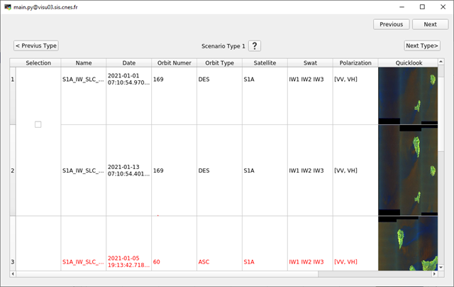   
INFERNO offers several scenarios, based on the previously selected products, to compute inteferograms. The choice of a scenario will define the SAR images that will be used for the processes.
There are 4 different scenarios:
- scenario 1:
  Groups all products from the same satellite, with the same orbit and whose ROI (region of interest) is in a single swath.
  
- scenario 2:
  Groups all products from the same satellite with the same orbit, the same type of orbit (Ascending or Descending) and whose ROI overlaps 2 consecutive products.
  
- scenario 3:
  Groups all products with the same orbit and orbit type (Ascending or Descending) and whose ROI overlaps two bands of the same product.  
  (mixture of S1A and S1B products)

- scenario 4: Group all products where the shooting conditions are the same, but the ROI may not be fully included.

At this stage, a scenario must be selected.  
***WARNING*** : Scenarios 2 to 4 will concatenate the images, there may be discontinuities in the resulting images.  

### Processing selection 
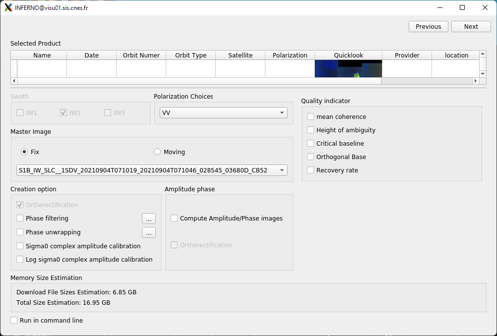   
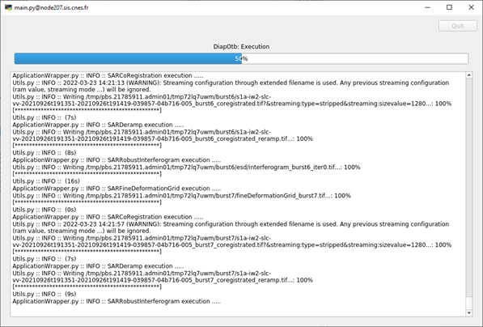 

INFERNO will always compute an interferogram. but it also offers several other processing choices:
  - Polarization choice
  - Mater Images reference:
    - fixed: All interferograms will be computed using the same image as master image.  
    - moving: Master image will change for each interferogram. Interferometric couple are define according to the date.
  - Phase filtering: Generate a filtered interferogram (GoldStein filtering). Unfiltered results are still available.
  - Calibration: Generate calibrated images
  - Amplitude Phase: Generate Amplitude/Phase images of the Sentinel-1 raw product. Only images with the same polarization that contains the whole ROI will be computed.
  - Quality Indicator: INFERNO can compute some quality indicators: 
    - Mean Coherence: mean and standard deviation of the coherence (the coherence map is available in the third band of the resulting interferogram)  
    - Height of ambiguity
    - Critical baseline
    - Orthogonal Bases
    - Recovery rate

### Output
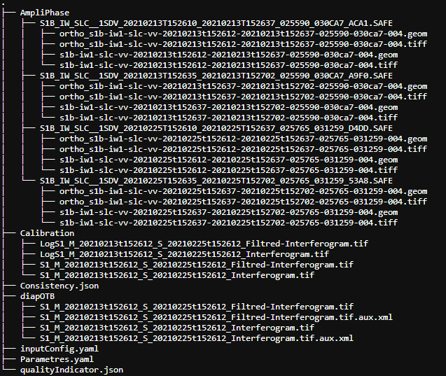   

The output folder of INFERNO will always contain a folder named ***diapOTB*** where interferograms (filtered or not, according to options), are saved, and 2 other files:
  - [***inputConfig.yaml***](#inputconfigyaml) with the parameters defined in section [Parameters](#parameters).
  - [***Parameters.yaml***](#parametersyaml) which sums up the selected processes that were applied and that were chosen in [Processing selection](#treatment-selection).

The output folder may contain (according to selected treatment options):
  -  a folder named ***AmpliPhase*** with Amplitude/Phase images of the raw Sentinel-1 product used to compute interferograms (the fist band is the Amplitude, and the second one is the Phase). There is a file for each Sentinel-1 product.
  -  a folder named ***Calibration*** with calibrated images.
  -  a file named [***qualityIndicator.json***](#qualityindicatorjson) with the value of selected quality indicators.  

The output interferograms are restrained to the ROI. If the ROI overlaps several images, then the images are concatenated.

#### auth.yaml
The authentication information can be provided from a file (see below). The path to this file must then be specified in the "auth/PEPS" field of the input.yaml file.  
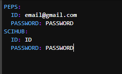 


#### inputconfig.yaml
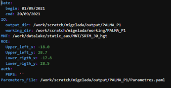

#### Parameters.yaml 
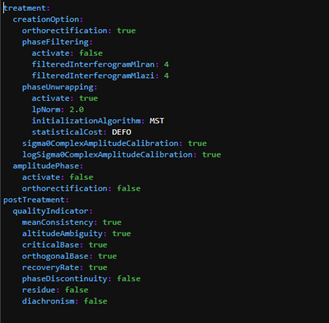 

#### qualityIndicator.json
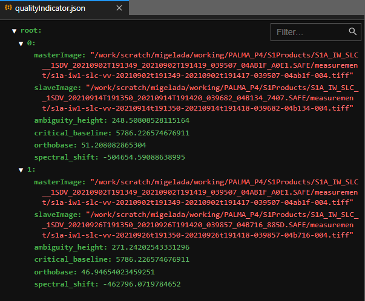 

#### Interferogram
These images represent interferograms over *La Palma*, that are generated by INFERNO. The ROI was located between 2 swaths, so the images were concatenated to obtain a single interferogram (Type 3 scenario).
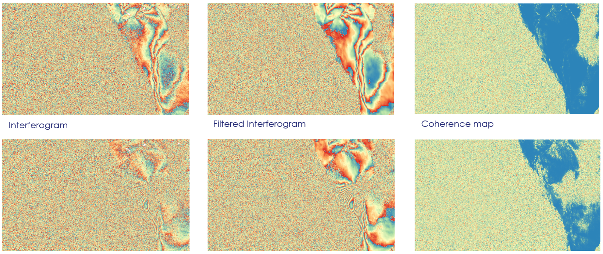
